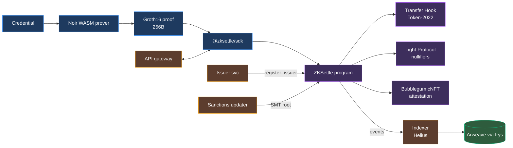
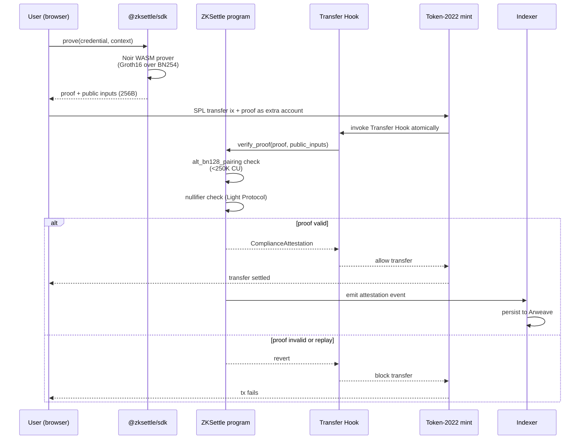

# ZKSettle

**Zero-knowledge compliance infrastructure for Solana stablecoins.**

ZKSettle is a compliance API that lets fintechs prove regulatory conformance (travel rule, sanctions screening, jurisdiction checks) without exposing user PII on-chain. Built natively for Solana using Groth16 proofs over BN254, Token-2022 Transfer Hooks, and Light Protocol state compression.

> **Status:** Active development — Colosseum Frontier 2026 hackathon submission. Target submission date: **May 11, 2026**.

---

## Table of contents

- [The problem](#the-problem)
- [The solution](#the-solution)
- [Architecture](#architecture)
- [Technology stack](#technology-stack)
- [Repository layout](#repository-layout)
- [Getting started](#getting-started)
- [Documentation](#documentation)
- [License](#license)

---

## The problem

The travel rule requires financial institutions to exchange counterparty identity data for transfers above $1,000. On public blockchains, this creates an unsolvable paradox without zero-knowledge cryptography:

- **Reveal the data on-chain** → violates GDPR, LGPD, and privacy regulations
- **Do not reveal** → violates the GENIUS Act, travel rule, and compliance requirements

No native ZK compliance solution exists on Solana. Every stablecoin fintech today rebuilds centralized compliance from scratch, spending 3–6 months and $200K–$500K. Even then, user data sits on centralized servers, exposed to breaches.

---

## The solution

ZKSettle provides a production-ready compliance primitive on Solana:

- **Client-side proof generation.** Users generate Groth16 proofs locally in the browser via WebAssembly. Zero PII ever leaves the device.
- **Atomic on-chain verification.** Token-2022 Transfer Hooks intercept every transfer. Valid proof → transfer approved. Missing or invalid proof → transfer blocked. Bypass is mathematically impossible.
- **Privacy-preserving audit trail.** Every verified transaction produces an immutable on-chain attestation anchored by a Merkle root, with full attestation data stored permanently on Arweave.
- **Drop-in integration.** Fintechs ship compliance in days, not months, via the `@zksettle/sdk` TypeScript package.

### Primary use case — Travel rule compliance

1. User completes KYC with an issuer (Persona, Sumsub, Jumio, or mock in hackathon). Issuer signs a credential: `{wallet, jurisdiction, expiry, sanctions_clear}`.
2. Issuer adds the wallet to a private Merkle tree and publishes the root on-chain via `register_issuer()`.
3. When transferring USDC, the user generates a ZK proof locally in under 10 seconds. No data leaves the browser.
4. The user submits a standard SPL transfer instruction with the proof attached as an extra account.
5. The Transfer Hook intercepts the transfer, verifies the Groth16 proof via `alt_bn128` syscalls (<250K compute units, <$0.001; see ADR-022). The thin-slice program uses Reilabs' [`gnark-verifier-solana`](https://github.com/reilabs/sunspot) (Sunspot) crate, which wraps those syscalls — we do not call them directly.
6. Valid proof → transfer settles atomically. Invalid proof → transfer reverts.
7. A `ComplianceAttestation` is emitted on-chain as an immutable audit record.

---

## Architecture

### High-level data flow



### Transfer execution sequence



### Components

| Component | Purpose | Location |
|---|---|---|
| **ZK Compliance Circuit** | Proves Merkle membership, sanctions exclusion, jurisdiction check, expiry, and nullifier — all in one Groth16 proof | `circuits/` (Noir) |

> ℹ️ The circuit implements all five compliance checks (Merkle membership, sanctions exclusion, jurisdiction, credential expiry, nullifier) with 11 public inputs. The verifier key in `backend/programs/zksettle/src/generated_vk.rs` is regenerated from `default.vk` by `build.rs`; any circuit change requires refreshing the VK before on-chain proofs will verify. The deployed VK currently binds 8 public inputs (indices 0–7); indices 8–10 (sanctions_root, jurisdiction_root, timestamp) await VK regeneration.
| **Anchor program** | On-chain verifier. Exposes `init_attestation_tree()`, `register_issuer()`, `update_issuer_root()`, `verify_proof()`, `check_attestation()`, plus the hook flow: `init_extra_account_meta_list()`, `set_hook_payload()`, `settle_hook()`, `transfer_hook()` | `backend/programs/zksettle/` (Rust) |
| **Transfer Hook** | Atomic Token-2022 compliance gate. Client stages a proof payload with `set_hook_payload`; Token-2022's Execute entry (or a direct `settle_hook` call) rebinds it to the live transfer, runs `verify_bundle`, and mints a compressed nullifier + attestation via Light CPI. Standalone calls are rejected via the `TransferHookAccount.transferring` flag. | `backend/programs/zksettle/` |
| **Issuer service** | Credential issuance, Merkle tree maintenance, root publication | `backend/crates/issuer-service/` (Rust) |
| **Indexer** | Consumes Helius webhooks, persists audit trail to Arweave | `backend/crates/indexer/` (Rust) |
| **API gateway** | Billing, rate limiting, tier enforcement | `backend/crates/api-gateway/` (Rust) |
| **Sanctions updater** | Daily OFAC fetch → Sparse Merkle Tree update → on-chain root publication | `backend/crates/sanctions-updater/` (Rust) |
| **Shared types** | Account layouts, policy schemas, attestation format | `backend/crates/zksettle-types/` (Rust) |
| **Crypto primitives** | Poseidon hashing, Merkle tree, SMT operations | `backend/crates/zksettle-crypto/` (Rust) |
| **TypeScript SDK** | `prove()`, `wrap()`, `audit()` for fintech integration | `sdk/` (TypeScript) |
| **Dashboard** | Live proof feed, attestation explorer, audit export | `frontend/` (Vite + React) |

---

## Technology stack

### On-chain

| Layer | Technology | Rationale |
|---|---|---|
| Runtime | Solana + SBF | Only chain with `alt_bn128` pairing syscalls |
| Program framework | Anchor 0.31 | Standard Solana framework with Token-2022 helpers |
| Proof system | Groth16 over BN254 | 256-byte proofs, O(1) verification, native syscalls |
| Circuit language | Noir + Sunspot compiler | Solana Foundation-supported toolchain |
| Hash function | Poseidon2 | ZK-friendly, 100× fewer constraints than SHA-256 |
| Token standard | Token-2022 + Transfer Hooks | Atomic, non-bypassable compliance enforcement |
| State compression | Light Protocol | 200–5000× cheaper nullifier storage |
| Compressed NFT | Metaplex Bubblegum | Attestations as cNFTs for cross-program consumption |

### Off-chain services (all Rust)

| Layer | Technology | Rationale |
|---|---|---|
| Language | Rust 2024 edition | Unified stack, crypto library dominance, shared types with on-chain program |
| Async runtime | tokio | Standard async runtime |
| HTTP framework | axum | Ergonomic, composable, fast compile |
| Solana client | solana-client, solana-sdk | Official SDK |
| ZK primitives | light-poseidon, ark-bn254, ark-groth16, arkworks | Battle-tested Rust crypto ecosystem |
| Merkle tree | rs_merkle + custom Poseidon wrapper | Compatible with in-circuit hashing |
| Sparse Merkle Tree | Custom with Poseidon | Required for sanctions non-membership proofs |
| Database | PostgreSQL via sqlx | Compile-time query verification |
| Queue | tokio::sync::mpsc (in-process) or Redis via deadpool-redis | Webhook fan-out |
| Cron | tokio-cron-scheduler | OFAC daily pull |
| Observability | tracing + tracing-subscriber | Structured JSON logs |
| HTTP client | reqwest | OFAC fetch, Arweave upload |
| Permanent storage | Irys + Arweave | Immutable audit trail for regulators |
| On-chain indexer | Helius webhooks | Managed indexing, free tier sufficient for MVP |
| Serialization | serde + borsh | Matches Anchor account layouts |

### Client

| Layer | Technology | Rationale |
|---|---|---|
| Proof generation | `@noir-lang/backend_barretenberg` + WASM | Client-side, zero PII to server |
| SDK | TypeScript + `@solana/web3.js` v2 | Modern functional API, 10× smaller bundle |
| Workers | comlink | Off-main-thread proof generation, no UI freeze |
| Prover cache | idb-keyval (IndexedDB) | Witness memoization, faster repeat proofs |

---

## Repository layout

All Rust code lives inside `backend/` as a single Cargo workspace. The frontend, SDK, and circuits stay at the root so they have independent toolchains and CI pipelines.

```
zksettle/
├── backend/                      # Rust workspace (on-chain + off-chain services)
│   ├── programs/
│   │   └── zksettle/             # Anchor program (verifier + transfer hook)
│   ├── crates/
│   │   ├── zksettle-types/       # Shared types between on-chain and off-chain
│   │   ├── zksettle-crypto/      # Poseidon2, Merkle, SMT wrappers
│   │   ├── issuer-service/       # HTTP service for credential emission
│   │   ├── indexer/              # Helius webhook consumer → Arweave
│   │   ├── api-gateway/          # Billing, rate limit, tier enforcement
│   │   └── sanctions-updater/    # OFAC cron job
│   ├── Anchor.toml
│   └── Cargo.toml                # Rust workspace root
├── circuits/                     # Noir ZK circuits (Nargo toolchain)
│   ├── src/
│   └── Nargo.toml
├── scripts/
│   └── fixture-noir/             # Test-vector generator (Nargo crate)
├── sdk/                          # TypeScript SDK (@zksettle/sdk)
│   ├── src/
│   └── package.json
├── frontend/                     # Vite + React dashboard
│   ├── src/
│   └── package.json
├── tests/                        # End-to-end tests (Playwright)
├── docs/                         # Internal specs and planning documents
├── pnpm-workspace.yaml           # JS/TS monorepo config
├── zksettle_prd.md               # Product Requirements Document
├── zksettle_adr.md               # Architecture Decision Records
├── zksettle_pitch.md             # Hackathon pitch document
├── IMPLEMENTATION_STATUS.md      # Ground truth: code vs docs reconciliation
└── README.md
```

---

## Getting started

> **Note:** Full development setup is published alongside the SDK release. The steps below are placeholders pending the Week 1 build.

### Prerequisites

- Rust 1.80+ with 2024 edition
- Solana CLI 1.18+
- Anchor 0.31+
- Node.js 20+ with pnpm
- Noir (via `noirup`) + Sunspot compiler
- Docker (for local PostgreSQL and Redis)

### Clone and build

```bash
git clone https://github.com/<org>/zksettle
cd zksettle
pnpm install                              # frontend + sdk dependencies
(cd backend && cargo build --workspace)   # Rust workspace
(cd backend && anchor build)              # Anchor program
(cd circuits && nargo compile)            # Noir circuits
```

### Run local devnet

```bash
solana-test-validator --reset
(cd backend && anchor deploy)
(cd backend && cargo run --bin issuer-service)
pnpm --filter frontend dev
```

### Run tests

```bash
(cd backend && cargo test --workspace)    # Rust services
(cd backend && anchor test)               # On-chain program
(cd circuits && nargo test)               # Noir circuits
pnpm --filter sdk test                    # SDK (Vitest)
pnpm --filter e2e test                    # End-to-end (Playwright)
```

---

## Documentation

| Document | Purpose |
|---|---|
| [`zksettle_prd.md`](./zksettle_prd.md) | Product Requirements Document — vision, users, use cases, requirements, MVP scope, metrics, 5-week plan |
| [`zksettle_adr.md`](./zksettle_adr.md) | Architecture Decision Records — eight accepted decisions (ADR-001 through ADR-008) plus proposed enhancements (ADR-009 through ADR-018) and three decided/implemented records (ADR-019 through ADR-022) |
| [`zksettle_pitch.md`](./zksettle_pitch.md) | Hackathon pitch narrative |

---

## License

TBD — likely Apache 2.0 or MIT for the SDK, Business Source License for the on-chain program pre-mainnet.

---

## Acknowledgements

- Solana Foundation for the `alt_bn128` syscalls and the `solana-foundation/noir-examples` reference repository
- Aztec / Noir team for the Noir language and Barretenberg backend
- Reilabs for the Sunspot Groth16 compiler
- Light Protocol for ZK state compression primitives
- Colosseum for the Frontier 2026 hackathon
